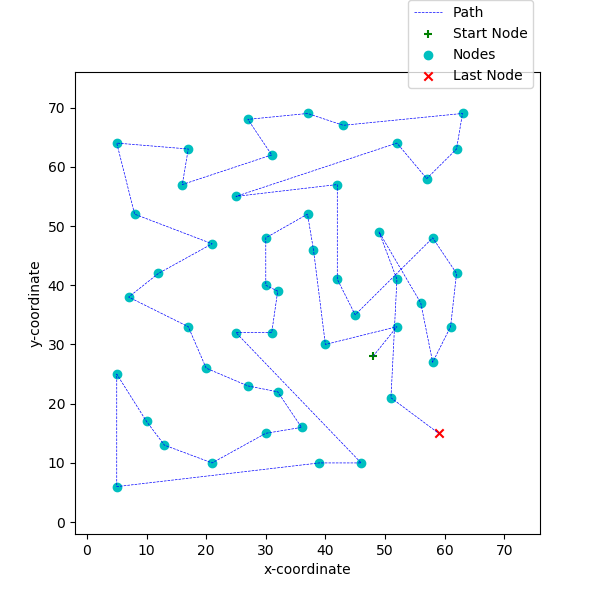

# Approx_Algo_Metric_TSP

### Important Links  
**Google Drive:** https://drive.google.com/drive/folders/1iQzAVdQytJrctcUTW_0OMvOrLhjRr4Vc?usp=sharing  
**Repository:** https://github.com/YashBansod/CMSC_818B_Approx_Algo_Metric_TSP  
**Screencast:** https://drive.google.com/open?id=1MNniJMYw6viUou8udv-qtn165ki07zP7  
**TSPLIB documentation:** https://wwwproxy.iwr.uni-heidelberg.de/groups/comopt/software/TSPLIB95/tsp95.pdf   

### Author's Note  
I firmly believe in writing source code with good readability. Its a fact that any source code is read more number of
times than it is written. And hence, I have tried my best to maintain good readability in the code.  
There are some computations that yield a lot of performance by vectorization. In these conditions, I decided on
high performance at the cost of a little reduced readability.  

Some key highlights about the source code:
- The source code in this project is 100 % PEP-8 compliant.
- All the important parameters, expected datatypes, returns and return types are documented. 
(except in cases where the names make it obvious).  
  
  
### Run Instructions  
- Open the terminal.  
- If you are accessing this project from github, clone it onto your system.  
`git clone https://github.com/YashBansod/CMSC_818B_Approx_Algo_Metric_TSP`  
- If you have a python virtual environment, activate it. Else you will be using the system default python environment.  
- In the terminal, browse to the directory containing this project.  
- Install the requirements of this project. `pip install -r requirements.txt`  
- Run the question_1.py as python file.  
`python question_1.py -p "<absolute path to a problem ".tsp" file> -v`  
  

**Note:** Run the help option of the python file to see all argument options. `python question_1.py -h`  

### Developed on:
- Windows 10 (version 1903)  
- Pycharm Professional 2019.2  
- Python 3.7.3  
**Note:** I have written the code keeping in mind about the back compatibility with Python 2.7. However, I have tested
it on Python 3.7.3 only. If you find any difficulties in executing the code on any other version, try using a virtual 
interpreter of python 3.7.3 or report the error to me for resolution.  

### Problem 1: Implementation of MST based 2-approximation algorithm for solving Metric TSP  

#### Steps in the Solution  
**1.	Compute the Distance Array, Darr.**  
The distance array holds the distance value of every node with other nodes. This distance calculation should be done 
according to the TSPLIB documentation:.

**2.	Compute the minimum spanning tree (MST).**  
The MST is calculated using a greedy algorithm.  
a.	Start with an empty tree, T  
b.	Initialize T with the edge of minimum length (Darr is used for this). This edge will add two new nodes in the tree.  
c.	Modify all values in Darr that mark distance of other nodes to these nodes to a very high value.  
d.	Add these nodes to an empty list, OL, denoting the open nodes.  
e.	Find the minimum edge from the opened nodes using Darr. This edge will add a new node in the tree.  
f.	Add the newly opened node to OL.  
g.	Modify all values in Darr that mark distance of other nodes to the newly opened node to a very high value.  
h.	Repeat steps ‘e’ to ‘g’ till length of OL is equal to number of nodes in the graph.  

**3.	Computation of 2-approximation Hamiltonian circuit.**  
A simple depth first traversal (DFS) is done on the MST. While doing the traversal, if an edge is repeated, the path is
cut short to a node in the DFS that hasn’t been seen before.  

**4.	Heuristics used to improve the solution.**  
A simple heuristic to untangle the Hamiltonian circuit was used. Intersection checks between the edges is done 
iteratively for a specified number of passes to reduce the length of the Hamiltonian circuit.  

### Results  

  

---
Author: Yash Bansod  
UID: 116776547  
E-mail: yashb@umd.edu  
Organisation: University of Maryland, College Park  