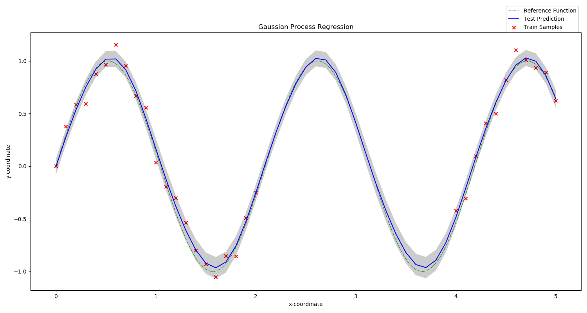
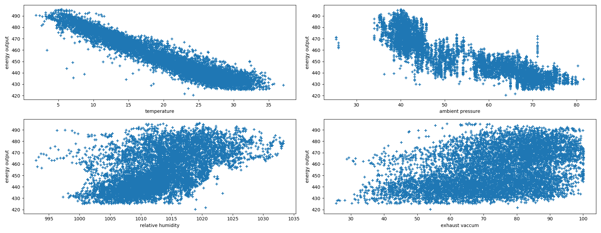

# Gaussian_Processes
### Important Links 

**Google Drive:** https://drive.google.com/drive/folders/10U8g9pcQ7CUGoMPV2hQwnR0gPRc-ICEn?usp=sharing  
**Repository:** https://github.com/YashBansod/CMSC_818B_Decision_Making_in_Robotics/Gaussian_Processes  

Some key highlights about the source code:
- The source code in this project is 100 % PEP-8 compliant.

### Run Instructions  
- Open the terminal.  
- If you are accessing this project from github, clone it onto your system.  
`git clone https://github.com/YashBansod/CMSC_818B_Gaussian_Processes`  
- If you have a python virtual environment, activate it. Else you will be using the system default python environment.  
- In the terminal, browse to the directory containing this project.  
- Install the requirements of this project. `pip install -r requirements.txt`  
- Run the problem4a_sol.py as python file.  
`python problem4a_sol.py -v -d`  
- Run the problem4b_sol.py as python file.  
`python problem4b_sol.py -v -w`  
  

**Note:** Run the help option of the python file to see all argument options. `python problem4a_sol.py -h`

**Note:** You may have to add the project directory to the PATH environment variable.  
For linux:  
`export PYTHONPATH=$PYTHONPATH:<absolute path to project directory>`  

For windows:  
`set PYTHONPATH=%PYTHONPATH%;<absolute path to project directory> `  

### Developed on:
- Windows 10 (version 1903)  
- Pycharm Professional 2019.2  
- Python 3.7.3  
**Note:** I have written the code keeping in mind about the back compatibility with Python 2.7. However, I have tested
it on Python 3.7.3 only. If you find any difficulties in executing the code on any other version, try using a virtual 
interpreter of python 3.7.3 or report the error to me for resolution.  

### Results  

   

  

---
Author: Yash Bansod  
UID: 116776547  
E-mail: yashb@umd.edu  
Organisation: University of Maryland, College Park  