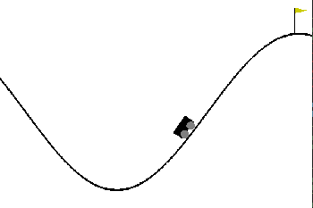

# Q_learning
### Important Links  

**Google Drive:** https://drive.google.com/drive/folders/10fpWJJ92SCjZ-gV1rOac0aVbyJg_O_dH?usp=sharing   
**Repository:** https://github.com/YashBansod/CMSC_818B_Decision_Making_in_Robotics/Q_learning    

Some key highlights about the source code: 

- The source code in this project is 100 % PEP-8 compliant.

### Run Instructions  

- Open the terminal.  
- If you are accessing this project from github, clone it onto your system.  
  `git clone https://github.com/YashBansod/CMSC_818B_Q_learning`  
- Download the saved_models folder from the google drive link and place the folder in this project's directory.
- If you have a python virtual environment, activate it. Else you will be using the system default python environment.  
- In the terminal, browse to the directory containing this project.  
- Install the requirements of this project. `pip install -r requirements.txt`  
- Run the problem1_sol.py as python file.  
  `python problem1_sol.py -t -v -d`  

**Note:** Run the help option of the python file to see all argument options. `python problem1_sol.py -h`

**Note:** You may have to add the project directory to the PATH environment variable.  
For linux:  
`export PYTHONPATH=$PYTHONPATH:<absolute path to project directory>`  

For windows:  
`set PYTHONPATH=%PYTHONPATH%;<absolute path to project directory> `  

### Developed on:

- Windows 10 (version 1903)  
- Pycharm Professional 2019.2  
- Python 3.7.3  
  **Note:** I have written the code keeping in mind about the back compatibility with Python 2.7. However, I have tested
  it on Python 3.7.3 only. If you find any difficulties in executing the code on any other version, try using a virtual 
  interpreter of python 3.7.3 or report the error to me for resolution.  
  
  
### Results  

Solved Mountain Car Problem:  

   

Policy Visualization for Problem 1 (Unmodified Reward) (Experiment 2 in writeup):  

   

Policy Visualization for Problem 1 (Unmodified Reward) (Experiment 1 in writeup):  

   

---

Author: Yash Bansod  
UID: 116776547  
E-mail: yashb@umd.edu  
Organization: University of Maryland, College Park   