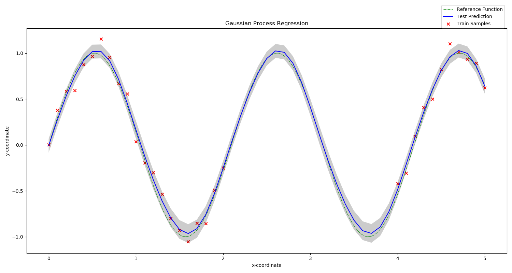
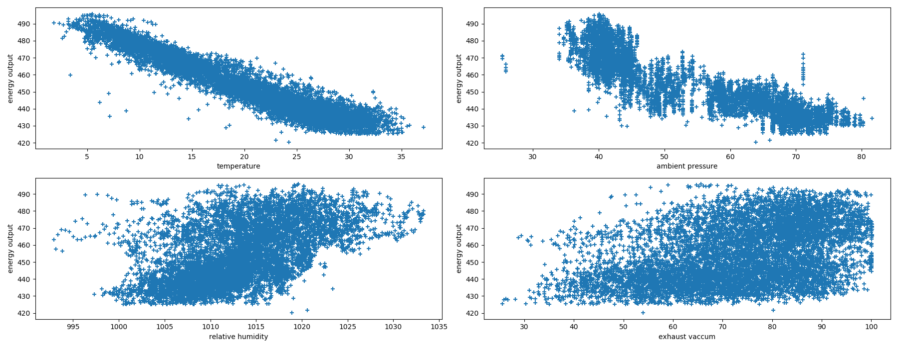
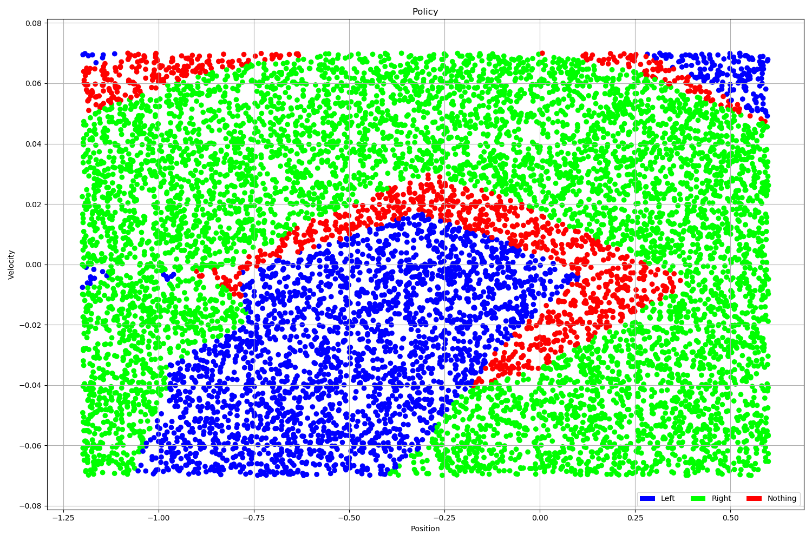
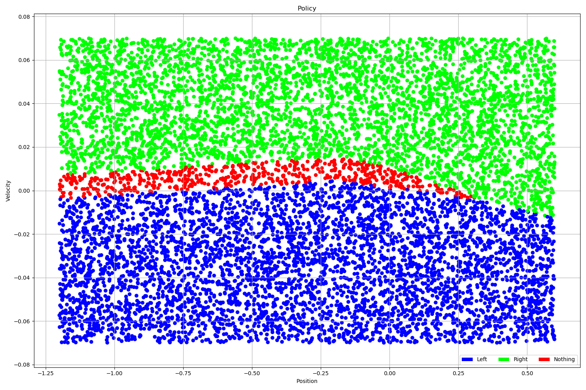

# CMSC_818B_Decision_Making_in_Robotics
Python implementation of projects for Decision making in robotics

## Project Contents

### [Approx_Algo_Metric_TSP](./Approx_Algo_Metric_TSP/)

Python Implementation of MST based 2-approximation algorithm for solving Metric TSP 

  

## [Gaussian_Processes](./Gaussian_Processes/)

Python Implementation of Gaussian Process Regression using Scikit Learn

   

  

## [Q_learning](./Q_learning/)

Python implementation of Q-learning using Neural Networks

Solved Mountain Car Problem:  

   

Policy Visualization for Problem 1 (Unmodified Reward) (Experiment 2 in writeup):  

   

Policy Visualization for Problem 1 (Unmodified Reward) (Experiment 1 in writeup):  

   

---

